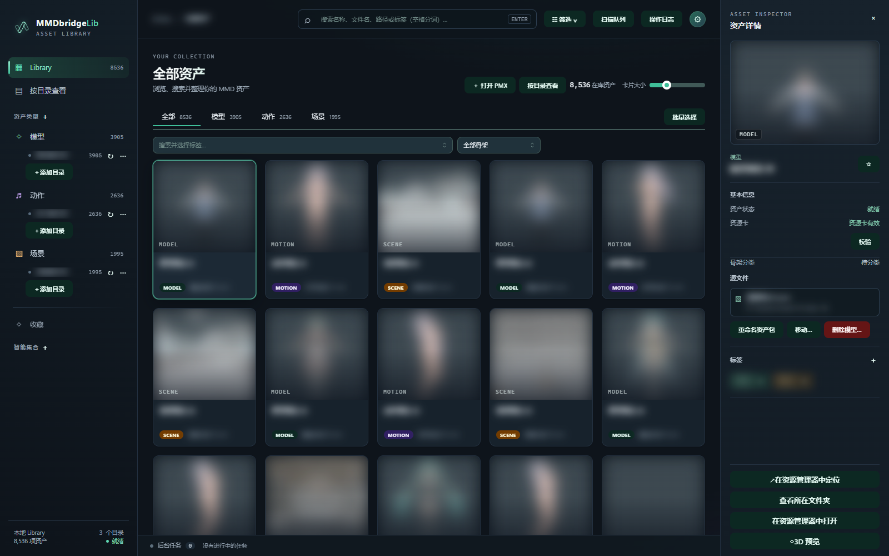
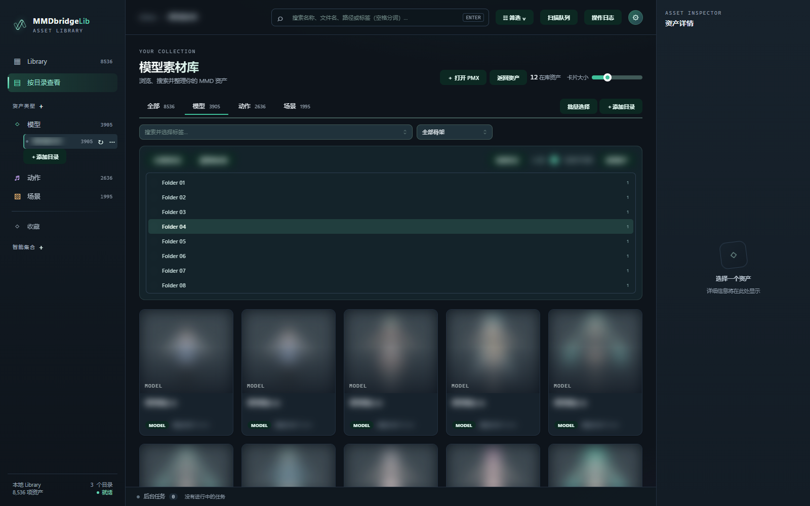
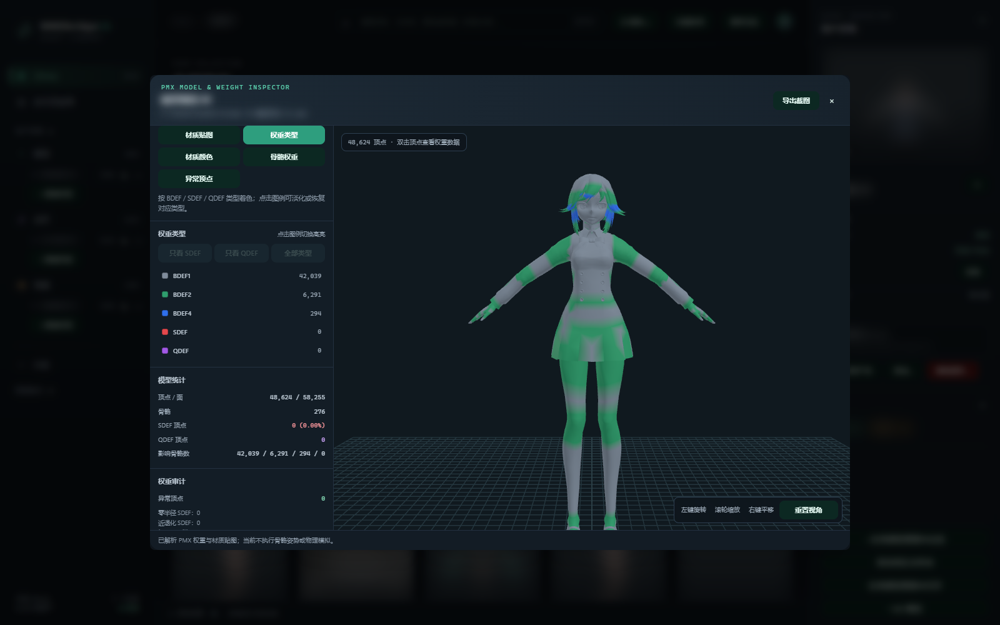
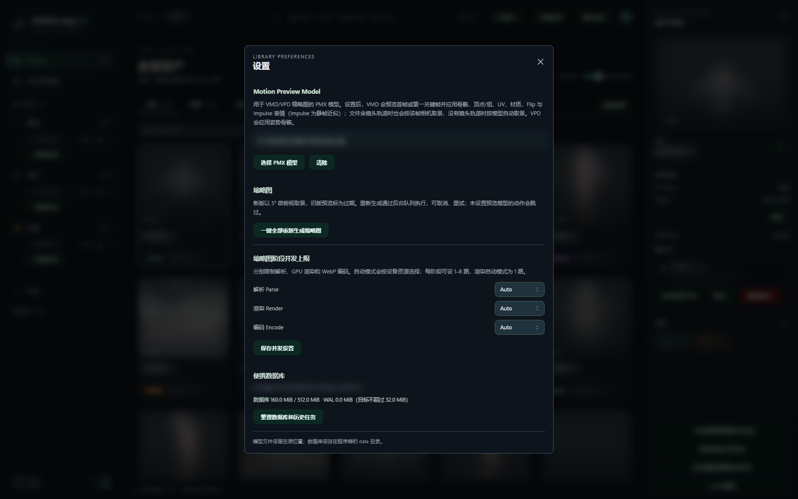

# MMDbridgeLib

> 🚧 **施工中 · alpha0.1**：首个公开预览版本，功能、界面和数据结构仍在持续完善。

MMDbridgeLib 是一款面向 **Windows 10 / 11** 的本地优先 MMD 资产管理工具，用于集中浏览、预览和整理模型、动作、姿势与场景。它面向已有的本地素材目录建立索引，让散落在文件夹中的资源成为可搜索、可筛选的资产库。

[下载 alpha0.1 便携版](https://github.com/JDui/MMDbridgeLib/releases/tag/alpha0.1) · [反馈问题与建议](https://github.com/JDui/MMDbridgeLib/issues)

## 界面预览

以下为当前界面的无窗口预览，使用脱敏的只读素材数据与 Core 模型预览数据。素材名称、路径、标签和缩略图已做隐私处理。

**资产库与详情**

查看文件夹浏览、模型权重与设置预览

**文件夹浏览**

**模型权重查看器**

**预览与缩略图设置**

## 资产库与文件夹浏览

- **统一资产库**：添加模型、动作或场景根目录，递归扫描并提取基本信息，通过缩略图卡片浏览素材。
- **文件夹视图**：保留原有目录组织方式，使用可折叠、独立滚动的目录树浏览资源，并切换是否包含子目录。
- **搜索与整理**：组合搜索和筛选条件，管理用户标签、收藏与智能集合；支持批量添加、移除标签及切换收藏。
- **可观察的后台任务**：扫描提供阶段、进度和队列，支持暂停、继续、停止、重试与调整待执行顺序；缩略图任务可取消和重试。

## 缩略图与 3D 预览

- **资源卡与缩略图**：由软件核心生成资产信息和本地预览，支持单项重新生成以及在设置中批量更新缩略图。
- **PMX 模型查看器**：从资产库或本地文件打开模型，查看材质贴图、骨骼、线框和顶点；支持 BDEF / SDEF / QDEF 类型统计、逐骨骼权重与 SDEF 参数检查。
- **场景查看器**：以 3D 视角浏览场景，支持键鼠移动和视角控制。
- **VMD 动作查看器**：使用设置中的 PMX 预览模型播放动作、定位帧，并切换文件内镜头或已关联的配套镜头。
- **VPD 姿势预览**：使用预览模型生成姿势缩略图；当前通过缩略图查看。

## 关联与文件整理

软件根据文件名、目录和解析信息提供动作与相机、版本家族的关联建议，由用户确认。纯相机 VMD 保留为动作配套资源，不占用普通资产列表。

资产包支持移动、重命名和移到 Windows 回收站。执行前会展示源路径、目标路径、受影响资产和依赖检查结果，并将操作记录保存在本地，便于检查未完成的操作。模型删除支持选择仅回收所选 PMX 或整个模型文件夹。

## 当前格式范围

| 资源 | 索引与预览范围 |
| --- | --- |
| 模型 | PMX，内置 3D 查看与权重检查 |
| 动作 / 姿势 | VMD / VPD，提供元数据与缩略图；VMD 支持 3D 动作播放 |
| 场景 | PMX / PMD，提供元数据、缩略图与场景预览 |

`.X` 格式已退出支持。模型权重查看、动作播放和缩略图采用不同的预览路径，复杂材质、物理和变形效果仍在完善，显示结果可能与 MMD 有差异。

## 本地优先

MMDbridgeLib 使用 Rust Core、Tauri 和 React。扫描、解析、索引、资源卡及预览数据由同一个 Rust 核心处理，桌面程序与命令行工具共用这些能力。

便携包包含桌面程序 `mmdbridge-desktop.exe` 和命令行工具 `mmdbridge.exe`，两者共用 EXE 所在目录下的 `data/library.sqlite3`。保留该 `data` 目录即可保留本地索引、标签和收藏；升级前建议备份。资源卡也可能写入素材旁的 `.MMDRCV` 文件。

核心资产管理无需云端账号，不依赖 Python Runtime，也无需另外安装 MMD 或 PMXEditor。桌面界面使用 Microsoft Edge WebView2 Runtime。

alpha0.1 是开发中的预览版本，欢迎通过 Issues 反馈问题。提交预览问题时，请附上复现步骤、格式和必要的截图，并遵守素材作者的配布与使用规则。
